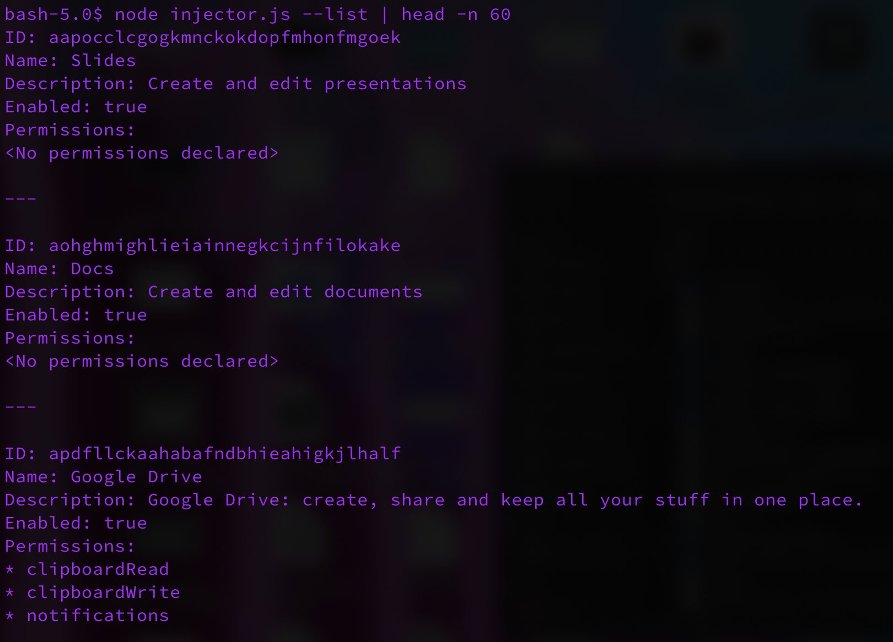

# comfortably-run
### A tool for injecting into Chrome origins & extensions via the Chrome DevTool Protocol

## Usage

```
$ node injector.js --help
Usage: injector [options]

comfortably-run is a CLI utility which can be used to inject JavaScript into arbitrary Chrome origins via the Chrome DevTools Protocol.

Options:
  -V, --version         output the version number
  -h, --host <value>    Host that Chrome/Chromium is running remote debugging on (default 'localhost').
  -p, --port <number>   Port which remote debugging is hosted on (default 9222). (default: 9222)
  -m, --method <value>  The method of injection. Works either by evaluating in an existing page ("existing") or by creating a new page in the background for the
                        origin ("create") if one does not exist. Default is "existing" which will fail if no pages exist with the origin specified. Note that this
                        will *not* affect the original script as the injected script is run in an isolated world. (default: "existing")
  -c, --cleanup         Only available if using the "create" method. Closes out the created page after injecting the script. (default: false)
  -s, --script <value>  Either a path to a JavaScript file or inline JavaScript to execute in the specified origin.
  -o, --origin <value>  The origin to inject the JavaScript into, such as https://example.com or chrome-extension://cjpalhdlnbpafiamejdnhcphjbkeiagm
  -l, --list            List currently installed extensions and their permissions. (default: false)
  -gp, --getpolicy      Get Chrome browser enterprise policy. (default: false)
  --help                display help for command
```

To inject arbitrary JavaScript into arbitrary origins for a Chrome browser you must first have a Chrome instance with the DevTools protocol listeners enabled. This can be done by launching Chrome with the `--remote-debugging-port` flag:

```
/Applications/Google\ Chrome.app/Contents/MacOS/Google\ Chrome --remote-debugging-port=9222
```

Once the instance is running you can do a variety of things with the CLI tool. You can do things like dump all extensions and their allowed permissions, dump the configured enterprise policy, and of course inject JavaScript into arbitrary origins (including extensions origins).

Here is an example of injecting a script into an extension's origin:

```
$ node injector.js -m create -c -s "JSON.stringify(Object.keys(window.chrome))" -o chrome-extension://cjpalhdlnbpafiamejdnhcphjbkeiagm
*** Result of your injected script ***
Return type: string
Returned data:
["loadTimes","csi","app","browserAction","commands","contextMenus","extension","i18n","management","permissions","privacy","runtime","storage","tabs","webNavigation","webRequest","windows"
```

The above command demonstrates a few things which we'll break down by flag:

* `-m create` This is specifying the injection mode as "create" (vs "existing"). The "create" mode is similar to the "existing" mode in one key way: if no windows or background pages exist with the specified origin then a background window will be created to inject into. While this is fairly stealthy, their is a brief visual cue.
* `-c` This flag only works with `-m create`, it will automatically close a window after it's been created for the script injection (if one was created due to no existing windows with that origin being present).
* `-s "JSON.stringify(Object.keys(window.chrome))"` This flag is specifying a script to inject into the origin we specified. In this case we're dumping all of the `chrome.*` APIs available to the `uBlock Origin` extension. **Importantly**, we should ensure the returned data is a string and not a complex object. You can also specify code that returns a promise and the CLI tool will automatically wait for appropriate resolution before returning the results.
* `-o chrome-extension://cjpalhdlnbpafiamejdnhcphjbkeiagm` This specifies the origin to inject our script into, in this case the `uBlock Origin` extension.


**Note About Enterprise Policy & Injection**

This tool becomes especially useful for restricted environments where only a few extensions are allowed access to certain Chrome extension APIs. With this tool you can bypass these restrictions by injecting into extensions explicitly whitelisted for those priveleges.

## Screenshots

### Dumping Chrome Enterprise Policy


### Injecting into an Arbitrary Origin


### List All Extensions and Their Allowed Permissions
